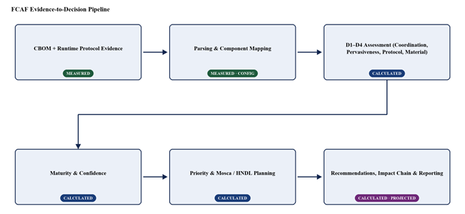
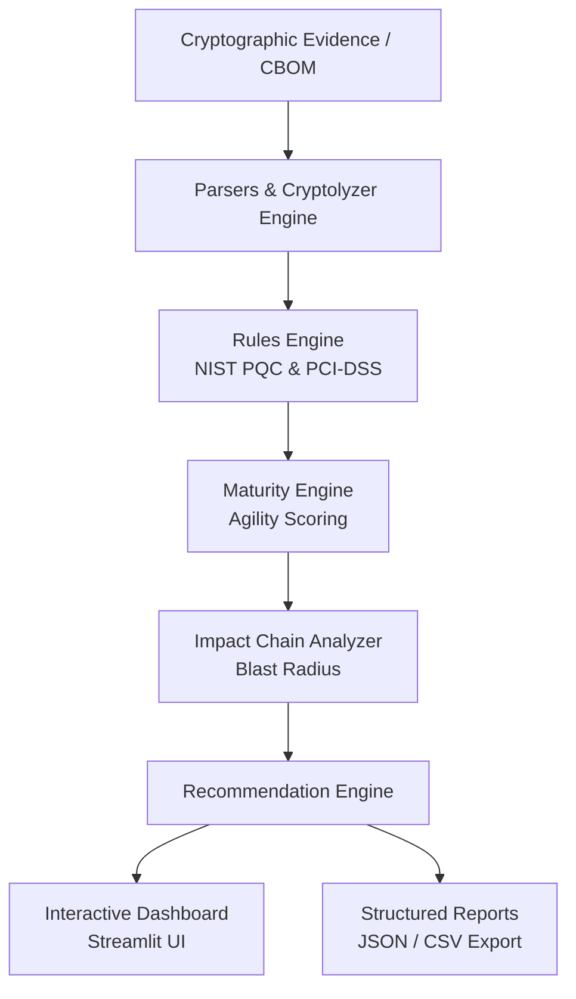

# FCAF: Framework for Cryptographic Agility Assessment

**FCAF** is a modular security assessment framework designed to discover, benchmark, and evaluate cryptographic assets across software components and payment ecosystems. It quantifies cryptographic agility, maps Post-Quantum Cryptography (PQC) readiness, and simulates cascading risks across interdependent services.

---

## 🏗️ Architecture & Pipeline

### FCAF Evidence-to-Decision Pipeline
The framework processes cryptographic posture across an end-to-end multi-tier pipeline:

### 2. Execution Pipeline Workflow

---

## ⚙️ How It Works (Pipeline Stages)

1. **Evidence Collection (`CBOM + Runtime Protocol Evidence`)**
   - Ingests raw Cryptographic Bill of Materials (CBOM) alongside runtime TLS scanning logs (*Measured*).

2. **Parsing & Mapping (`parsers.py`, `cryptolyzer_parser.py`)**
   - Normalizes evidence into structured cryptographic components and configurations (*Measured / Config*).

3. **Multi-Dimensional Assessment (`D1–D4 Assessment`)**
   - Evaluates agility across four core dimensions: **Coordination**, **Pervasiveness**, **Protocol**, and **Material** (*Calculated*).

4. **Maturity & Confidence Scoring (`maturity_engine.py`)**
   - Quantifies the cryptographic agility index and confidence interval based on empirical evidence (*Calculated*).

5. **Priority & Mosca / HNDL Planning**
   - Analyzes migration urgencies under Mosca's Theorem and **Harvest Now, Decrypt Later (HNDL)** quantum risk models (*Calculated*).

6. **Recommendations & Impact Chain (`recommendation_engine.py`, `impact_chain.py`)**
   - Computes blast radius, models cascading dependency risk, and exports actionable remediation steps and reports (*Calculated / Projected*).
---

## 💳 Payment Simulation Environment (`payment_simulation/`)

- **`pki/`**: Automated Key Rotation and CA hierarchy management.
- **`payment_gateway/`**: Agility evaluation during transaction signing and algorithm switching.
- **`open_banking/`**: mTLS and token handling across financial APIs.

---

## 📂 Project Structure

text
crypto-agility-FCAF/
├── app.py                     # Streamlit interactive dashboard
├── main.py                    # CLI entry point
├── maturity_engine.py         # Maturity scoring and evaluation logic
├── rules.py                   # Cryptographic compliance rules
├── parsers.py                 # CBOM and multi-source parsers
├── cryptolyzer_parser.py      # Network and TLS evidence parser
├── impact_chain.py            # Blast radius and dependency analyzer
├── recommendation_engine.py   # Migration and remediation generator
├── report_generator.py        # Report generation utilities
├── payment_simulation/        # Mock PKI and payment ecosystem
│   ├── certificate_authority/ # CA lifecycle & mTLS simulation
│   ├── open_banking/          # API security and token handling
│   ├── payment_gateway/       # Transaction signing simulation
│   └── pki/                   # Key rotation and agility handlers
├── docs/                      # Documentation, papers, and presentations
│   ├── WORKFLOW.md            # Detailed workflow mechanics
│   └── technical_paper/       # Scientific methodology & evidence
└── tests/                     # Automated unit and integration test suite

---

## 🚀 Quickstart

powershell
# Clone and setup
git clone https://github.com/znxrtt/FCAF.git
cd FCAF

# Setup environment
python -m venv .venv
.\.venv\Scripts\Activate.ps1
pip install -r requirements.txt

# Run Dashboard
streamlit run app.py